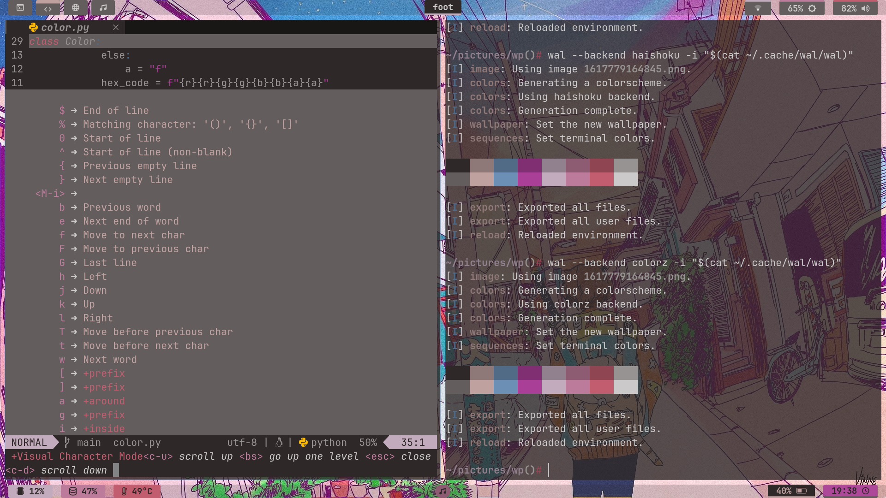
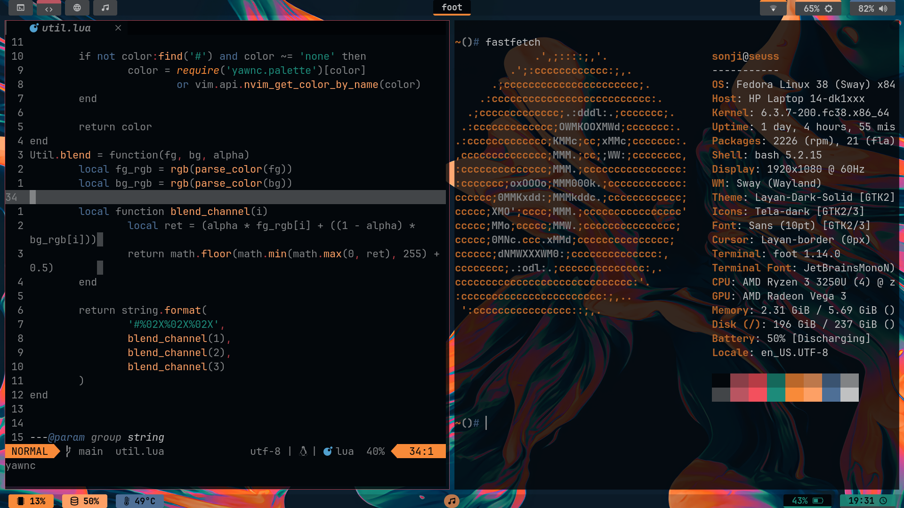
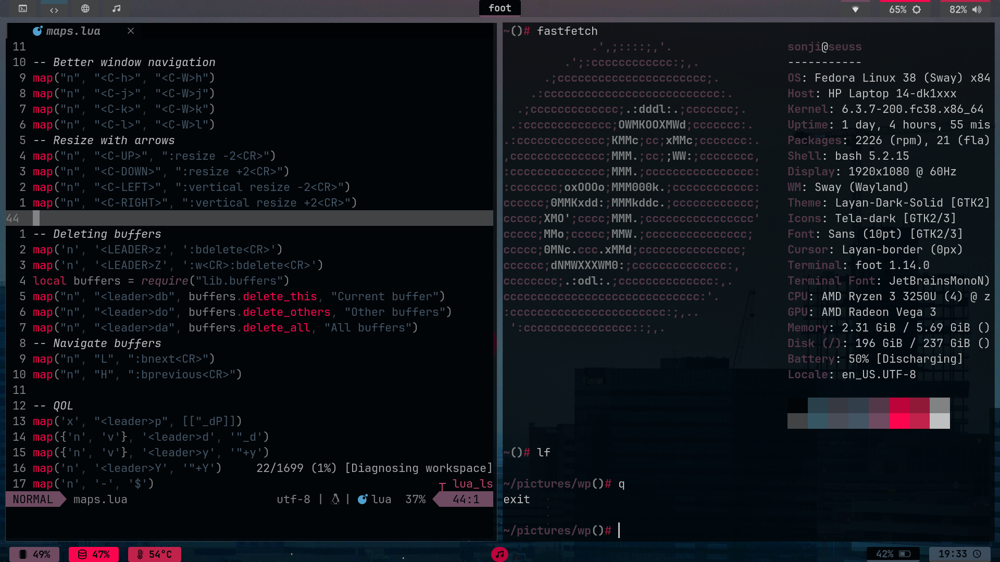
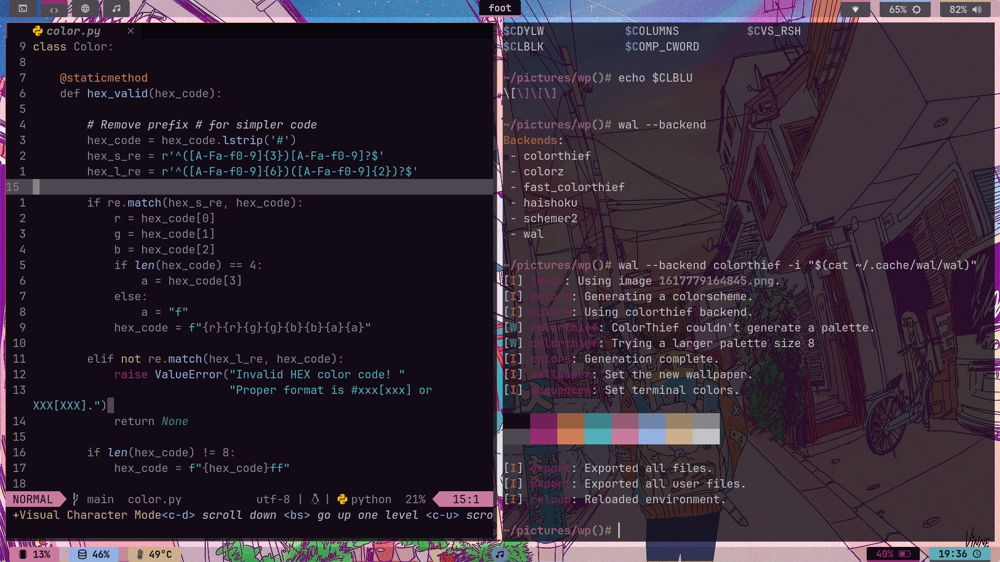
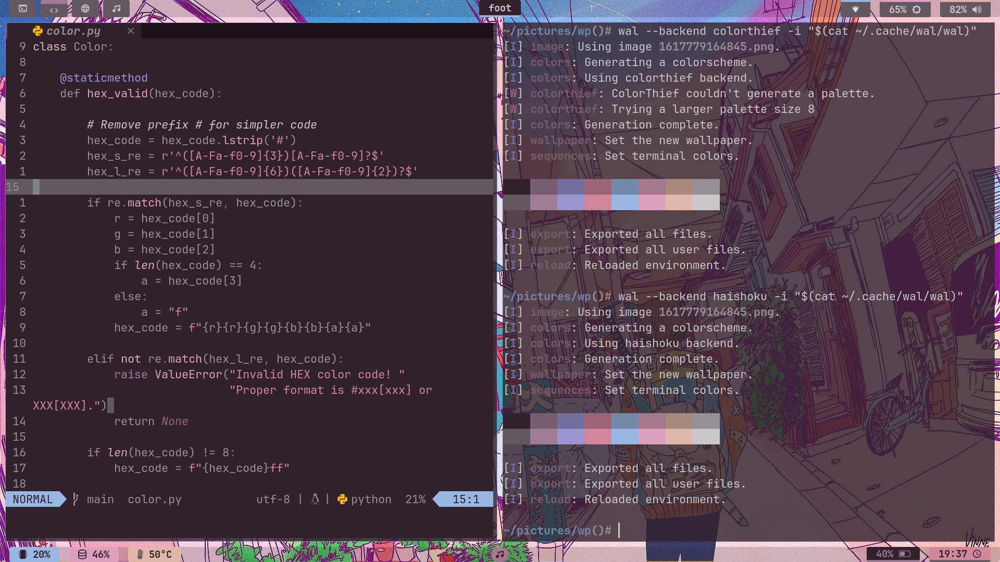
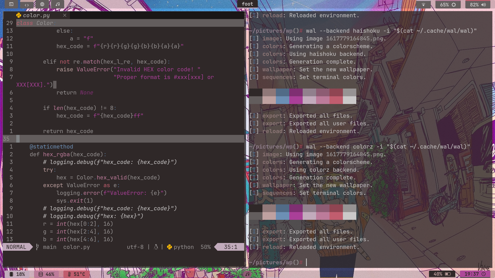
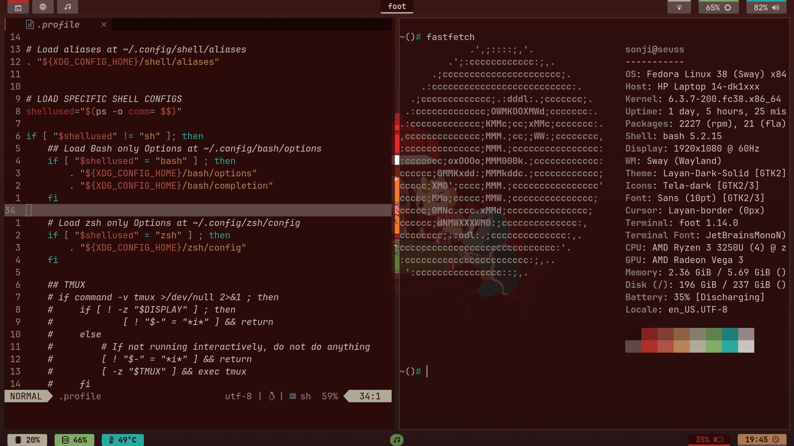

# Yet Another ~~py~~Wal Neovim Colorscheme

I was inspired by the lacklusterness of all other neovim colorschemes based on
pywal that I found online, so I made this.

Yawnc's code is based on the [rose-pine](https://github.com/rose-pine/neovim) nVim
colorscheme, which means that ~~all~~ *most of* the plugins that are supported by rose-pine,
are supported by this theme as well.

This is intended to be used with my pywal fork that takes advantage of my
iconema backend, but it can also be used with
[dylanaraps](https://github.com/dylanaraps)'
[pywal](https://github.com/dylanaraps/pywal).

## Screenshots

#### No caret/circumflex symbols in lualine!


#### Results depend on the colorscheme generated by pywal!









## External Plugin Support
Check rose-pine's github page till I update this.

## Installation

### lazy
Add `sonjiku/yawnc.nvim` to one of your plugin spec files.
```lua
not bothered enough to actually write this, sorry
```

### packer
```lua
use { "sonjiku/yawnc.nvim" }
```

### vim-plug
```vim
Plug "sonjiku/yawnc.nvim"
```

## Activate theme
Put this somewhere in your neovim config
```vim
vim.cmd.colorscheme("yawnc")
```


## How it works
Magic

## Enjoy
Or not

## TODO
- [ ] Add function that adjusts base01-07 to be *grays* based on base00.
- [ ] Add 2 extra colors for base08-base0F as for now, we only have 6 colors and one gray and white.
- [ ] Ensure plugin works well with original pywal.
- [ ] Add some documentation in order to help potential fork maintainers.
- [x] Feed cat.
- [x] Go for groceries
- [x] DFTBA
- [ ] Call therapist
